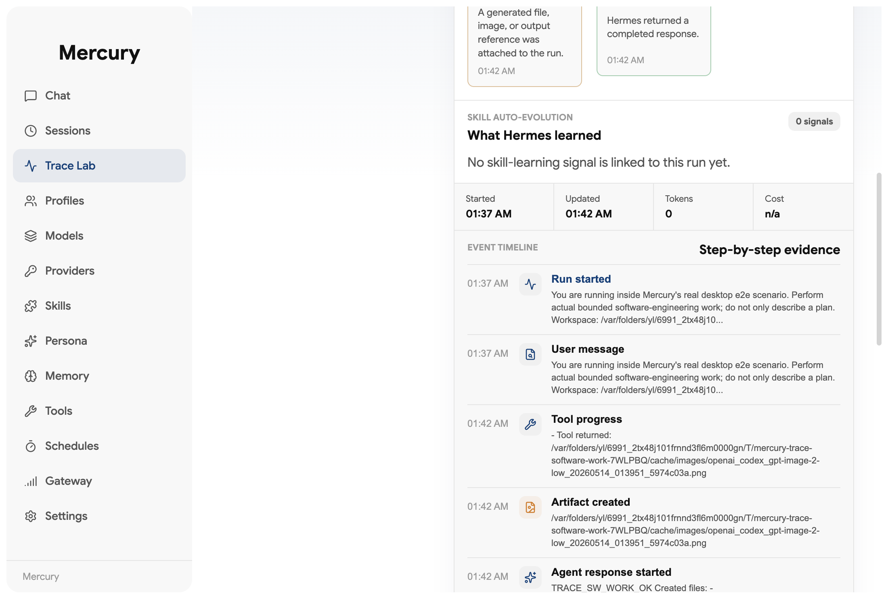
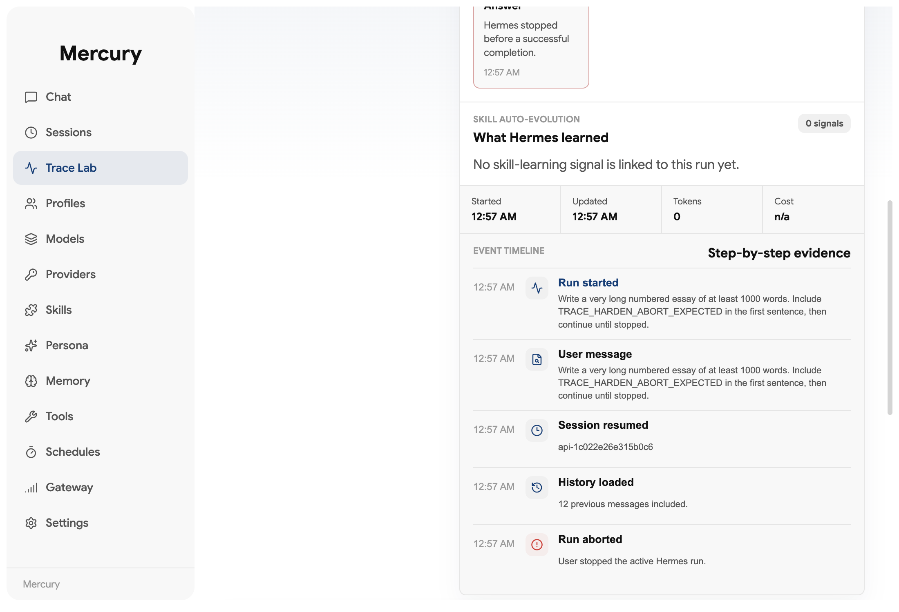

# Mercury

<p align="center">
  
</p>

<br/>
<p align="center">
  <a href="https://hermes-agent.nousresearch.com/docs/"></a>
  <a href="https://discord.gg/NousResearch"></a>
  <a href="https://github.com/fredluz/mercury/blob/main/LICENSE"></a>
  <a href="https://github.com/fredluz/mercury/releases/"></a>
<a href="https://github.com/fredluz/mercury/stargazers">
  
</a>
  <a href="https://github.com/fredluz/mercury/releases/">
  
</a>
</p>

> **This project is in active development.** Features may change, and some things might break. If you run into a problem or have an idea, open an issue in the Mercury repository. Contributions are welcome!

## Languages

- English: `README.md`
- 简体中文: `README.zh-CN.md`

Mercury is a native desktop front end for installing, configuring, tracing, and operating [Hermes Agent](https://github.com/NousResearch/hermes-agent) — a self-improving AI assistant with tool use, multi-platform messaging, and a closed learning loop.

Instead of managing the CLI by hand, the app walks through install, provider setup, and day-to-day usage in one place. It uses the official Hermes install script, stores Hermes in `~/.hermes`, and gives you a GUI for chat, sessions, the Agents screen, memory, skills, tools, scheduling, messaging gateways, and more.

## Fork & Attribution

Mercury is a public fork and adaptation of [Hermes Desktop](https://github.com/fathah/hermes-desktop), built around [Hermes Agent](https://github.com/NousResearch/hermes-agent). The fork keeps the upstream MIT license and attribution intact while adding Mercury-specific work on trace inspection, skill-evolution workflows, run evaluation, and a more product-focused desktop surface.

We expect to keep pulling useful upstream improvements where they fit Mercury's direction.

### Mercury-specific work

Mercury is not just a renamed upstream build. This fork is focused on making Hermes usable as a desktop control surface for real agent work:

- **Mercury identity and packaging** — app name, icons, release metadata, Windows/Fedora packaging, and product docs target Mercury.
- **Codex app server path** — Codex app server is the recommended provider path, including Codex OAuth-backed app-server capabilities used by the runtime.
- **Chat as an operating surface** — richer chat activity, model/profile actions, generated titles, profile-aware session metadata, local slash-command traces, token/cost visibility, and clearer tool progress.
- **Trace Lab** — conversation-level trace inspection with event timelines for user messages, assistant output, tool calls, delegation, approvals, transport errors, artifacts, image generation, and skill-evolution signals.
- **Agents and profile isolation** — the Agents screen manages profile-backed Hermes workspaces, with profile labels on sessions, per-profile models/tools/skills/memory/persona, and diagnostics for session search latency.
- **Verification harnesses** — contract tests plus real Electron e2e sweeps for Trace Lab, sessions, and Codex-backed image/artifact flows.

## Install

Download the latest build from the Mercury releases page.

| Platform       | File                    |
| -------------- | ----------------------- |
| macOS          | `.dmg`                  |
| Linux (any)    | `.AppImage`             |
| Linux (Debian) | `.deb`                  |
| Linux (Fedora) | `.rpm`                  |
| Windows        | `.exe` (NSIS installer) |

### Windows (winget)

Once the manifest has been accepted into [`microsoft/winget-pkgs`](https://github.com/microsoft/winget-pkgs), you can install with:

```powershell
winget install FredLuz.Mercury
```

Until then, download the `.exe` from the Releases page.

> **Windows users:** The installer is not code-signed. Windows SmartScreen will warn on first launch — click "More info" → "Run anyway".

### Fedora (RPM)

```bash
sudo dnf install ./mercury-<version>.rpm
```

> **Fedora users:** The `.rpm` is not GPG-signed. If your system enforces signature checking, append `--nogpgcheck` to the install command. Auto-update is not supported for `.rpm` builds (limitation of `electron-updater`); reinstall the new `.rpm` to update.

### macOS

> **macOS users:** The app is not code-signed or notarized. macOS will block it on first launch. To fix this, run the following after installing:
>
> ```bash
> xattr -cr "/Applications/Mercury.app"
> ```
>
> Or right-click the app → **Open** → click **Open** in the confirmation dialog.

## Features

- **Guided first-run install** for Hermes Agent with progress tracking and dependency resolution
- **Codex app server provider path** — recommended for Mercury, including Codex OAuth-backed app-server capabilities and real-token agent workflows
- **Local, SSH, and remote-aware connection paths** — run Hermes locally on `127.0.0.1:8642`, use verified SSH-backed profiles, or store/test a pure remote Hermes API URL while profile-bound execution remains fail-closed until remote profile identity can be verified
- **Streaming chat workspace** with SSE streaming, tool progress indicators, markdown rendering, syntax highlighting, activity groups, profile-aware model actions, and generated titles
- **Token usage tracking** — live prompt/completion token counts and cost display in the chat footer, plus a `/usage` slash command
- **Slash commands** — `/new`, `/clear`, `/fast`, `/web`, `/image`, `/browse`, `/code`, `/shell`, `/usage`, `/help`, `/tools`, `/skills`, `/model`, `/memory`, `/persona`, `/version`, `/compact`, `/compress`, `/undo`, `/retry`, `/debug`, `/status`, and more
- **Trace Lab** — inspect complete conversations as trace units, expand individual runs, review event timelines, and audit messages, tools, delegation, approvals, artifacts, images, errors, and skill-evolution signals
- **Session management** — SQLite FTS5 search, date-grouped history, resume/search across conversations, profile labels, and latency-oriented diagnostics
- **Agents screen** — create, delete, and switch between profile-backed Hermes workspaces with isolated config, models, tools, skills, memory, and persona
- **14 toolsets** — web, browser, terminal, file, code execution, vision, image generation, TTS, skills, memory, session search, clarify, delegation, MoA, and task planning
- **Memory system** — view/edit memory entries, user profile memory, capacity tracking, and discoverable memory providers (Honcho, Hindsight, Mem0, RetainDB, Supermemory, ByteRover)
- **Persona editor** — edit and reset your agent's SOUL.md personality
- **Saved models and providers** — manage provider credentials and model configurations across Codex app server, hosted APIs, and local OpenAI-compatible servers
- **Scheduled tasks** — cron job builder (minutes, hourly, daily, weekly, custom cron) with 15 delivery targets
- **Messaging gateways** — Telegram, Discord, Slack, WhatsApp, Signal, Matrix, Mattermost, Email (IMAP/SMTP), SMS, iMessage, DingTalk, Feishu/Lark, WeCom, WeChat, Webhooks, and Home Assistant
- **Backup, import & debug dump** — full data backup/restore and system diagnostics from Settings
- **Log viewer** — view gateway and agent logs directly from the Settings screen
- **Auto-updater and packaging** — Electron updater support plus macOS, Windows, AppImage, Debian, and Fedora/RPM build targets
- **Test and e2e coverage** — Vitest contract coverage plus Electron sweeps for Trace Lab, sessions, and app-server workflows

## Mercury CLI

Mercury also ships a Node CLI named `mercury` for agents, scripts, CI jobs, and power users that need Mercury without launching Electron. The CLI uses the same shared main-process services as the desktop IPC path, so profile-aware sessions, memory, skills, runtime diagnostics, chat automation, gateway/install operations, and trace side effects stay aligned with the app.

Build it from source with:

```bash
npm run build:cli
```

Common automation examples:

```bash
mercury --json sessions list --limit 20
mercury --ndjson chat send "Summarize recent work"
mercury --profile work memory read --json
mercury runtime diagnostic --json
```

Use `--json` for stable success/error envelopes and `--ndjson` for streaming chat/progress events. See the full [CLI contract and command reference](docs/contracts/cli.md) for global flags, output shapes, exit codes, connection-mode behavior, and parity with `window.hermesAPI`.

## Preview

<table>
<tr>
<td width="50%" align="center"><b>Trace Lab event timeline</b><br/></td>
<td width="50%" align="center"><b>Trace Lab hardening evidence</b><br/></td>
</tr>
</table>

## How It Works

On first launch, the app:

1. Asks whether you want to run Hermes **locally** or configure a **remote** connection.
2. **Local mode:** checks whether Hermes is already installed in `~/.hermes`; if not, runs the official Hermes installer with dependency resolution (Git, uv, Python 3.11+).
3. **Remote mode:** prompts for the remote API URL and API key, validates basic reachability, and skips local install. Pure remote HTTP does not currently provide verified profile-bound execution, so chat/title/cron runtime paths fail closed until remote profile identity can be verified.
4. Prompts for an API provider or local model endpoint.
5. Saves provider config and API keys through Hermes config files.
6. Launches the main workspace once setup is complete.

In local mode, chat requests go through a verified profile runtime on `http://127.0.0.1:8642` or a profile-specific port, with SSE streaming. In SSH mode, Mercury verifies the profile-bound remote runtime through the tunnel before streaming. Pure remote HTTP can validate a configured endpoint, but profile-bound execution is intentionally unsupported until Mercury can prove the remote API is serving the requested profile. The desktop app parses supported streams in real time, rendering tool progress, markdown content, and token usage as it arrives.

## Screens

| Screen        | Description                                                                           |
| ------------- | ------------------------------------------------------------------------------------- |
| **Chat**      | Streaming conversation UI with slash commands, tool progress, and token tracking      |
| **Sessions**  | Browse, search, and resume past conversations                                         |
| **Agents**    | Create, delete, and switch between profile-backed Hermes agents                       |
| **Skills**    | Browse, install, and manage bundled and installed skills                              |
| **Models**    | Manage saved model configurations per provider                                        |
| **Memory**    | View/edit memory entries, user profile, and configure memory providers                |
| **Persona**   | Edit the active profile's persona (SOUL.md)                                           |
| **Tools**     | Enable or disable individual toolsets                                                 |
| **Schedules** | Create and manage cron jobs with delivery targets                                     |
| **Gateway**   | Configure and control messaging platform integrations                                 |
| **Settings**  | Provider config, credential pools, backup/import, log viewer, network settings, theme |

## Supported Providers

### LLM Providers

| Provider            | Notes                                    |
| ------------------- | ---------------------------------------- |
| **Codex app server** | Recommended provider for Mercury, including Codex OAuth-backed app-server capabilities and app-server-native image/artifact workflows |
| **OpenRouter**      | 200+ models via single API               |
| **Anthropic**       | Direct Claude access                     |
| **OpenAI**          | Direct GPT access                        |
| **Google (Gemini)** | Google AI Studio                         |
| **xAI (Grok)**      | Grok models                              |
| **Nous Portal**     | Free tier available                      |
| **Qwen**            | QwenAI models                            |
| **MiniMax**         | Global and China endpoints               |
| **Hugging Face**    | 20+ open models via HF Inference         |
| **Groq**            | Fast inference (voice/STT)               |
| **Local/Custom**    | Any OpenAI-compatible endpoint           |

Local presets are included for LM Studio, Ollama, vLLM, and llama.cpp.

### Messaging Platforms

Telegram, Discord, Slack, WhatsApp, Signal, Matrix/Element, Mattermost, Email (IMAP/SMTP), SMS (Twilio & Vonage), iMessage (BlueBubbles), DingTalk, Feishu/Lark, WeCom, WeChat (iLink Bot), Webhooks, and Home Assistant.

### Tool Integrations

Codex app-server image generation, Exa Search, Parallel API, Tavily, Firecrawl, Honcho, Browserbase, Weights & Biases, and Tinker.

## Development

### Prerequisites

- Node.js and npm
- A Unix-like shell environment for the Hermes installer
- Network access for downloading Hermes during first-run install

### Install dependencies

```bash
npm install
```

### Start the app in development

```bash
npm run dev
```

### Run checks

```bash
npm run lint
npm run typecheck
```

### Run tests

```bash
npm run test
npm run test:watch
```

### Build the desktop app

```bash
npm run build
```

Platform packaging:

```bash
npm run build:mac
npm run build:win
npm run build:linux
npm run build:rpm    # Fedora/RHEL .rpm only
```

## First-Time Setup

When the app opens for the first time, it will either detect an existing Hermes installation or offer to install it for you.

Supported setup paths in the UI:

- `Codex app server` (recommended)
- `OpenRouter`
- `Anthropic`
- `OpenAI`
- `Local LLM` via an OpenAI-compatible base URL

Local presets are included for:

- LM Studio
- Ollama
- vLLM
- llama.cpp

Hermes files are managed in:

- `~/.hermes`
- `~/.hermes/.env`
- `~/.hermes/config.yaml`
- `~/.hermes/hermes-agent`
- `~/.hermes/profiles/` — named profile directories
- `~/.hermes/state.db` — session history database
- `~/.hermes/cron/jobs.json` — scheduled tasks

## Tech Stack

- **Electron** 39 — cross-platform desktop shell
- **React** 19 — UI framework
- **TypeScript** 5.9 — type safety across main and renderer processes
- **Tailwind CSS** 4 — utility-first styling
- **Vite** 7 + electron-vite — fast dev server and build tooling
- **better-sqlite3** — local session storage with FTS5 full-text search
- **i18next** — internationalization framework
- **Vitest** — test runner

## Notes

- The desktop app depends on the upstream Hermes Agent project for agent behavior and tool execution.
- The built-in installer runs the official Hermes install script with `--skip-setup`, then completes provider configuration in the GUI.
- Local model providers do not require an API key, but the compatible server must already be running.
- Alternative npm registry routes are supported for environments with restricted network access.

## Contributing

Contributions are welcome! Check out the [Contributing Guide](CONTRIBUTING.md) to get started.

## Related Project

For the core agent, docs, and CLI workflows, see the main Hermes Agent repository:

- https://github.com/NousResearch/hermes-agent
