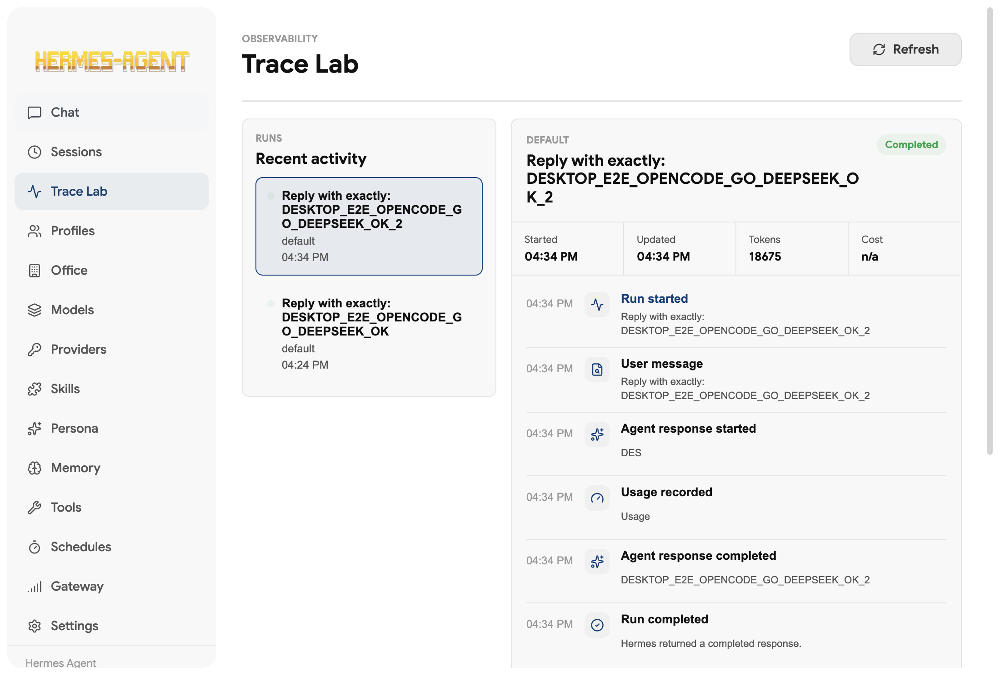

# OpenCode Go DeepSeek Desktop E2E

Date: 2026-05-12

## Target

Verify Hermes Desktop can drive Hermes Agent with the OpenCode Go provider and the `deepseek-v4-flash` model, then surface the completed run in Trace Lab.

## Provider Findings

- Pi is installed locally and lists `opencode-go/deepseek-v4-flash`.
- OpenCode is installed locally and lists `opencode-go/deepseek-v4-flash`.
- Hermes Agent supports provider `opencode-go` with model `deepseek-v4-flash`.
- Hermes Agent requires `OPENCODE_GO_API_KEY`; Pi/OpenCode auth can have the credential even when `~/.hermes/.env` does not.
- Hermes Desktop did not previously expose OpenCode Go as a first-class provider option. This fork now does.

## Execution Evidence

Pi direct smoke test:

```text
PI_OPENCODE_GO_DEEPSEEK_OK
```

Hermes direct smoke test with isolated `HERMES_HOME`:

```text
HERMES_E2E_OPENCODE_GO_DEEPSEEK_OK
```

Hermes Desktop E2E with isolated `HERMES_HOME`:

```json
{
  "modelText": "deepseek-v4-flash",
  "expected": "DESKTOP_E2E_OPENCODE_GO_DEEPSEEK_OK_2",
  "latestStatus": "completed",
  "eventTypes": [
    "run.started",
    "message.user",
    "message.agent.delta",
    "usage.recorded",
    "message.agent.delta",
    "run.completed"
  ],
  "eventCount": 6
}
```

Screenshot:


## Follow-Up

The phrase "Pi agent provider for Hermes" does not currently map to a Hermes Desktop provider. Pi itself can use OpenCode Go, and Hermes Agent can use OpenCode Go directly. If Hermes should literally spawn Pi as an agent backend, that is a new integration layer beyond the current Hermes provider registry.
