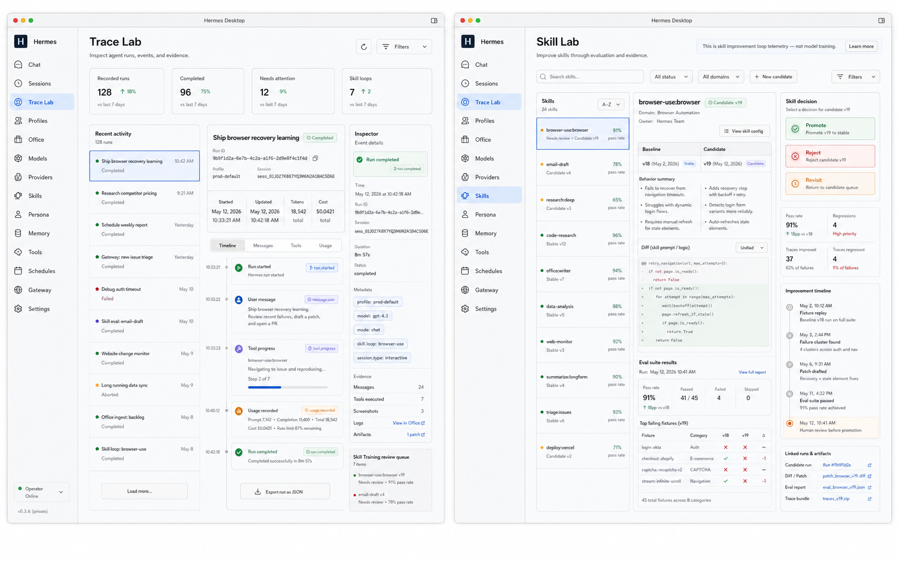

# Hermes Desktop Trace, Evaluation, and Skill Training Spec

Date: 2026-05-12

## Product Direction

This private mirror adapts Hermes Desktop from a terminal replacement plus chat UI into the primary macOS app for operating Hermes. Chat remains central, but every Hermes run should also become inspectable, reviewable, and improvable.

## First-Class Concepts

### Runs

A run is any Hermes execution:

- interactive chat
- scheduled task
- gateway-triggered task
- skill test
- skill improvement loop
- self-learning review

Each run should preserve:

- user intent
- profile and backend mode
- session id when available
- messages and streamed response chunks
- tool progress
- usage and cost
- errors and aborts
- trace events
- linked skill/eval activity

### Traces

Traces are structured agent events, not plain logs.

Each event answers:

- what happened
- when it happened
- which run/session/profile it belongs to
- what type of event it is
- what evidence or metadata is attached

Initial event types:

- `run.started`
- `message.user`
- `message.agent.delta`
- `tool.progress`
- `usage.recorded`
- `run.completed`
- `run.failed`
- `run.aborted`
- `skill.used`
- `skill.eval`
- `skill.promoted`
- `skill.rejected`

The current implementation records the events Hermes Desktop already sees through chat IPC and streaming callbacks. Later Hermes Agent should emit canonical structured trace events directly.

### Skill Training

Skill training is not model training. In this product it means a closed-loop improvement run for a reusable skill.

A skill training run should eventually capture:

- skill name
- baseline version
- candidate version
- fixture/eval set
- traces that improved
- traces that regressed
- generated patch or prompt change
- human notes
- promote/reject/revisit decision

## Product Screens

### Trace Lab

Trace Lab is the first screen added by this fork.

It should show:

- recent runs
- selected run detail
- ordered trace timeline
- tool and usage evidence
- skill/eval readiness panel
- future skill training queue

### Skill Lab

Skill Lab is the next major screen. It should be designed before implementation with GPT Image 2.

It should show:

- skill list
- health score per skill
- candidate changes
- eval suite results
- old/new behavior comparison
- promotion decision workflow

## GPT Image 2 Visual Target Prompts

These prompts are intended for GPT Image 2 high-fidelity UI generation.

Generated visual target:

### Run Detail Screen

Create a pixel-perfect macOS desktop app screenshot for "Hermes Desktop", a private AI agent app. The app window has native macOS traffic lights, a quiet professional sidebar, and a dense but readable operations dashboard. The selected section is "Trace Lab". The main screen is a three-column agent run detail view: left column recent runs with status chips, center column active chat/run transcript with a command composer and current tool progress, right column structured trace inspector. The trace inspector shows a vertical timeline with event types: run started, user message, tool progress, usage recorded, run completed. Include a "Why this happened" evidence panel below the selected event. The product should feel like a serious developer/operator tool, not a marketing page. Use light mode, neutral warm gray surfaces, restrained color accents, crisp typography, no decorative gradients, no glassmorphism, no large hero sections. Show UI labels for Runs, Chat, Trace, Skills, Evals, Memory, Settings. Make it look like a finished native macOS app.

### Skill Lab Screen

Create a pixel-perfect macOS desktop app screenshot for "Hermes Desktop" showing a "Skill Lab" screen. The app is for improving reusable AI agent skills, not training model weights. The layout has a sidebar, a top filter/search bar, a skill list, and a main comparison workspace. Show a selected skill called "browser-use:browser". The main area compares baseline version v18 to candidate v19 with eval suite results, traces improved, traces regressed, and a promote/reject/revisit decision panel. Include charts for pass rate and regression count, but keep them small and operational. Include a timeline of skill-training events: fixture replay, failure cluster found, patch drafted, eval suite passed, review required. The visual style should be a native macOS product dashboard: calm, information-dense, polished, no marketing hero, no cartoon art, no gradient text, no nested cards.
